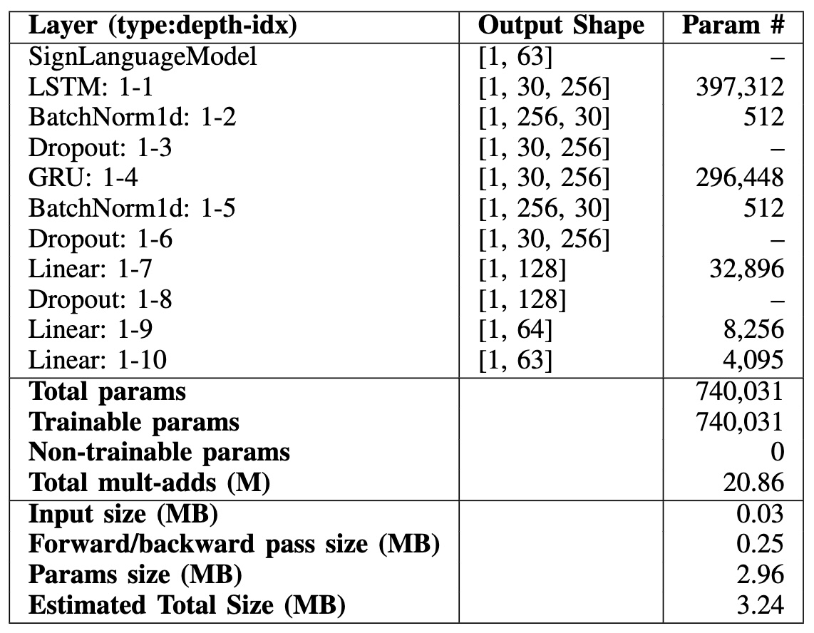

# Sign Language Recognition and Translation

Sign languages are visual languages that use manual and non-manual features, such as hand movements and facial expressions, to convey meaning instead of spoken words. Currently, it is estimated that around 466 million people rely on sign languages across the globe, highlighting their significance. Deaf individuals often face communication challenges due to limited English fluency, which creates a language barrier in both in-person and virtual environments. This project proposes a Computer Vision model that recognizes and translates sign language to enhance virtual communication, such as video calls.

The primary goal is to develop a highly accurate, real-time model that can run locally on devices like laptops or PCs. The system accesses the webcam, extracts body keypoints/features from the video feed, and employs a hybrid Recurrent Neural Network (RNN) model, combining Bidirectional Long Short-Term Memory (LSTM) and Bidirectional Gated Recurrent Unit (GRU) layers, to effectively capture the temporal dynamics of sign language gestures. While the model can be trained on any gesture-based language, this project focuses on American Sign Language (ASL).

One of the biggest challenges was building a dataset from scratch, containing a diverse range of ASL gestures under various conditions to ensure model robustness, as there is lack of video-based sign language datasets. The system demonstrated high accuracy and real-time translation capabilities, achieving 97.86\% training accuracy and 96.83\% testing accuracy, whilst reaching an average 29.10 FPS, with inference speeds of 0.034 seconds. However, due to applying a prediction smoothing technique to ensure quality and stability, the final prediction speed has been capped at 0.515 seconds. Above all, the final model is highly efficient, with a size of just 3.24 MB and 740,031 parameters, making it suitable for deployment on devices with limited computational resources.

Features:
- **Translation** - When the model detects sign language and understands the meaning, it shows the translation in the video feed as a caption.
- **Speech** - When the translation is complete, the model is capable of also outputting the translation to Speech, but this is still nder testing.

## Pipeline


The model accesses a computer's webcam using OpenCV library's function, extracts keypoints using MediaPipe library, then this is fed into the model and after the model judges with high confidence that it is sign language and the word being gestured is within the vocabulary of the model, it will output the translation as a caption within the video feed.

## Model architecture summary



## Keypoint extraction stages


As face keypoints added more complexity without providing processing time or accuracy benefits, these are removed before training the model.

## Building the dataset
The following figure shows the different conditions under which data was collected, showcasing MediaPipe's robust tracking capabilities. Different lighting conditions are tested, such as back-lighting in (e), where keypoints are still precisely tracked. These images also exhibit distinct body orientations and positions relative to the camera. In (d), a close-up is recorded, while in (e) the positioning of the body is at an angle, and in (f) the position of the individual is at the side, instead of at the center like in (a), (b), or (c). These examples illustrate the diverse conditions recorded to ensure a more robust model performance. It is important to highlight that these are the last frames of the videos.


**Vocabulary**

The dataset contains 63 words. It was entirely built by one person, but as it will be seen in the following subsection's video, the model generalized well, identifying without an issue the different words gestured by another person.

These can be categorized as follows:
- Words: Hello, Thank you, I love you, How are you?, Nice to meet you!, What's your name?, Deaf, Hearing, Hard of hearing, Goodbye, See you later, Sorry, Please, Good, Fine, Bad, Excuse me, Good morning, Good night, Hungry, Tired, Help, Busy.
- Alphabet Letters: A, B, C, D, E, F, G, H, I, J, K, L, M, N, O, P, Q, R, S, T, U, V, W, X, Y, Z.
- Numbers: 1, 2, 3, 4, 5, 7, 8, 10, 11, 12, 13, 14, 15, 20. Here some numbers were skipped (i.e. 0, 6, 9, 16, 17, 18, 19) as these were either too similar or the same as letters from the alphabet, for example O is the same as 0 and 6 the same as W, or too similar that the model got confused (i.e. 6 and 16 are similar but with added wrist rotation, and the same goes with 7 and 17, 8 and 18, and 9 and 19)

## Training and testing results

As it can be seen in the following figures, the model generalized well whilst training.


**Live generalization test**

To further demonstrate the model's capabilities of generalization, in the following video a demo can be seen where an individual who did not take part in the dataset construction gestured some words and the model predicted these without hesitation.

[Watch Live Demo Video](https://youtu.be/7yoR0goz4-U) ▶️

## Set Up & Deployment
To run the program, the following steps must be performed. 

1. Clone the repository
```shell
git clone https://github.com/siqiangwu/sign-language
cd web
```

2. Install the necessary packages
```shell
pip install -r requirements.txt
```

3. Open the Jupyter Notebook and experiment with it!
